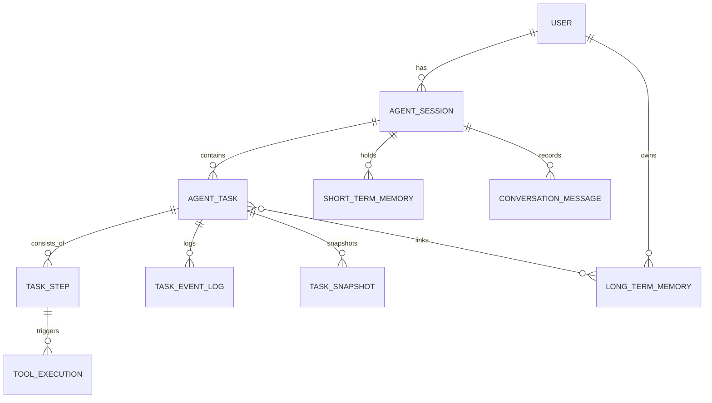

# Agent Memory Layer ER Diagram

เอกสารนี้สรุป ER Diagram สำหรับ Agent Memory Layer เพื่อรองรับ:

- Multi-step workflow
- Resume task
- Tool execution history
- Short-term / Long-term memory
- Audit & observability
- Scale ระดับ production

## High-Level ER Diagram (Logical View)

```text
User
 └──< AgentSession
        ├──< AgentTask
        │      ├──< TaskStep
        │      │      └──< ToolExecution
        │      ├──< TaskEventLog
        │      └──< TaskSnapshot
        │
        ├──< ShortTermMemory
        └──< ConversationMessage

AgentTask
 └──< LongTermMemoryLink >── LongTermMemory (Vector DB)
```

## Mermaid ER Diagram (for docs)



## Storage Mapping

| Layer | Storage |
|---|---|
| AgentTask / TaskStep / ToolExecution | PostgreSQL |
| ShortTermMemory | Redis (TTL) |
| LongTermMemory | Mongo + Vector DB |
| Conversation | PostgreSQL |
| Snapshot | PostgreSQL JSONB |

## Critical Indexes

- `AgentTask(session_id, status)`
- `TaskStep(task_id, step_index)`
- `ToolExecution(task_id)`
- `ShortTermMemory(session_id)`
- `LongTermMemory(user_id)`
- `ConversationMessage(session_id)`

Vector index recommendation:

- HNSW / IVF
- Cosine similarity

## Resume Flow

1. Load `AgentTask` where status = `RUNNING`
2. Load latest `TaskSnapshot`
3. Restore `current_step_index`
4. Continue `ToolExecution` loop
5. Append `TaskEventLog`

## Scalability Notes

- Partition `AgentTask` by `created_at` (monthly)
- Archive completed tasks > 90 days
- Async writes for `ToolExecution` logs
- Use CQRS if high concurrent agent load

## Production Extensions

- `RateLimitLog`
- `CostTracking` per tool
- `PolicyViolationLog`
- `PromptVersion` (experiment tracking)
