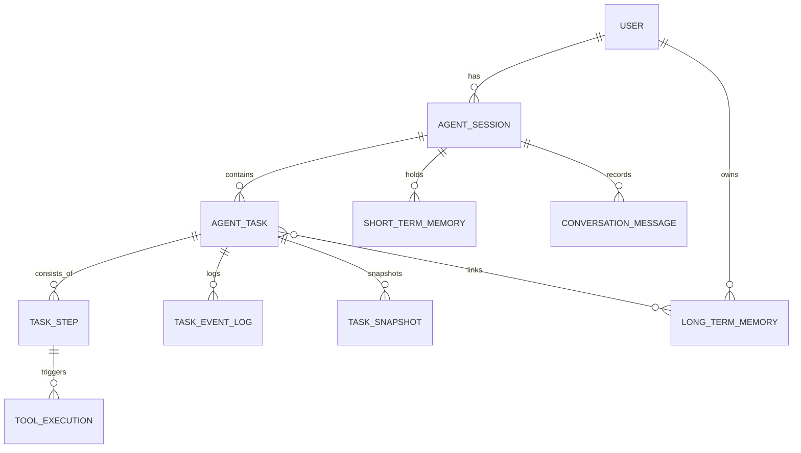

# ER Diagram สำหรับ Agent Memory Layer

**เวอร์ชัน:** 1.0
**วันที่:** 4 มีนาคม 2026
**ผู้จัดทำ:** ทีมสถาปัตยกรรมระบบ

---

### 1. ภาพรวม

เอกสารนี้แสดงแผนภาพความสัมพันธ์ของข้อมูล (Entity-Relationship Diagram) สำหรับ **Agent Memory Layer** ใน SmartNote AI. การออกแบบนี้มีเป้าหมายเพื่อรองรับฟีเจอร์ AI Agent ที่ซับซ้อน, สามารถขยายระบบได้, และง่ายต่อการตรวจสอบ (Auditability).

### 2. หลักการออกแบบ

-   **Stateful & Resumable:** ทุก Task ต้องสามารถหยุดและทำงานต่อได้ เพื่อรองรับ Workflow ที่ยาวนาน
-   **Auditability:** ทุกขั้นตอนและการตัดสินใจของ Agent ต้องถูกบันทึกเพื่อการดีบักและวิเคราะห์
-   **Scalability:** ออกแบบให้รองรับการเติบโตของข้อมูล ทั้งในเชิงจำนวน Task และความลึกของ Memory
-   **Decoupling:** แยกส่วนของ State, Memory, และ Execution ออกจากกันอย่างชัดเจน

### 3. High-Level ER Diagram (Logical View)

```text
User
 └──< AgentSession
        ├──< AgentTask
        │      ├──< TaskStep
        │      │      └──< ToolExecution
        │      ├──< TaskEventLog
        │      └──< TaskSnapshot
        │
        ├──< ShortTermMemory
        └──< ConversationMessage

AgentTask
 └──< LongTermMemoryLink >── LongTermMemory (Vector DB)
```

### 4. Mermaid ER Diagram



### 5. นิยาม Entities

#### 5.1. กลุ่ม Task & Workflow State

-   **USER:** บัญชีผู้ใช้หลัก
-   **AGENT_SESSION:** การสนทนาหรือ Interaction หนึ่งครั้ง (มี TTL 24 ชม.)
-   **AGENT_TASK:** เป้าหมายหลักที่ผู้ใช้สั่ง (เช่น "สร้างรายงานการประชุม")
-   **TASK_STEP:** ขั้นตอนย่อยในแผนที่ LLM สร้างขึ้น
-   **TOOL_EXECUTION:** การเรียกใช้เครื่องมือแต่ละครั้ง (รวมถึงการ Retry)
-   **TASK_SNAPSHOT:** State ของ Task ทั้งหมดที่บันทึกไว้ ณ เวลาใดเวลาหนึ่ง เพื่อการ Resume
-   **TASK_EVENT_LOG:** ล็อกสำหรับ Audit trail (เช่น `PLAN_CREATED`, `TOOL_FAILED`)

#### 5.2. กลุ่ม Memory

-   **SHORT_TERM_MEMORY:** ข้อมูลชั่วคราวใน Session (เก็บใน Redis)
-   **LONG_TERM_MEMORY:** Vector Embeddings และ Metadata ที่ถูกจัดทำดัชนีสำหรับ Semantic Search (เก็บใน Vector DB + PostgreSQL)
-   **LONG_TERM_MEMORY_LINK:** ตารางเชื่อมระหว่าง `AGENT_TASK` และ `LONG_TERM_MEMORY`

#### 5.3. กลุ่ม Conversation

-   **CONVERSATION_MESSAGE:** ประวัติการสนทนาระหว่างผู้ใช้และ AI

### 6. Physical Storage Mapping

| Layer | Storage Technology | Rationale |
| :--- | :--- | :--- |
| **Task & Workflow** | PostgreSQL | ACID-compliant, structured data |
| **Short-Term Memory** | Redis | Fast read/write, TTL support |
| **Long-Term Memory** | Vector DB (e.g., Pinecone) + Mongo | Specialized for similarity search |
| **Snapshots & Logs** | PostgreSQL (JSONB) / Clickhouse | Efficient for large, semi-structured data |

### 7. กลยุทธ์การทำ Index (Index Strategy)

-   **Primary Keys:** `id` (UUID) สำหรับทุกตาราง
-   **Foreign Keys:** `user_id`, `session_id`, `task_id` ต้องมี Index
-   **Query-heavy columns:** `status` ใน `AGENT_TASK`, `event_type` ใน `TASK_EVENT_LOG`
-   **Vector Index:** ใช้อัลกอริทึม HNSW หรือ IVF สำหรับการค้นหาแบบ Cosine Similarity

---
